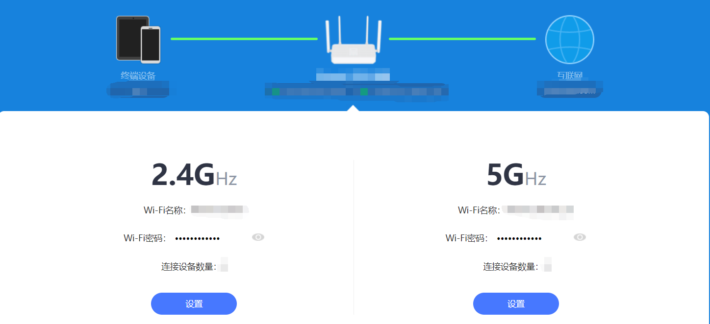
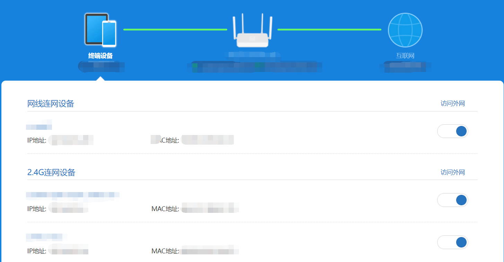
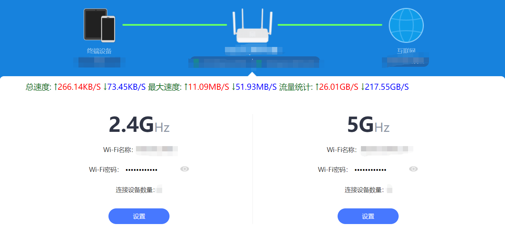
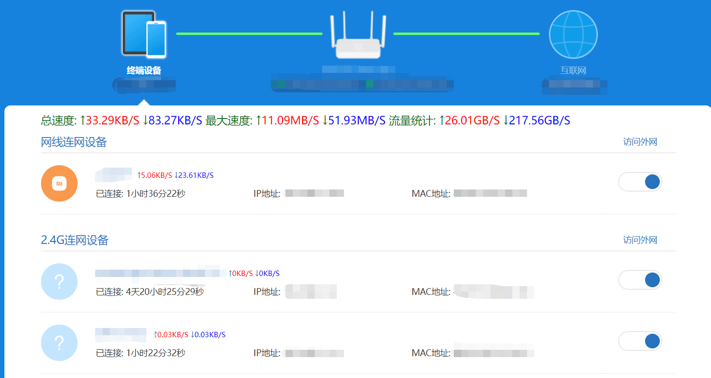

### 在小米路由器管理网页显示 实时速度，最大速度，总流量与具体设备的实时速度与连接时间，数据每秒更新
#### 灵感来源于 [[小米路由器增强脚本](https://greasyfork.org/zh-CN/scripts/425113-小米路由器增强脚本)](https://greasyfork.org/zh-CN/scripts/425113-小米路由器增强脚本)

启用前:

启用后

